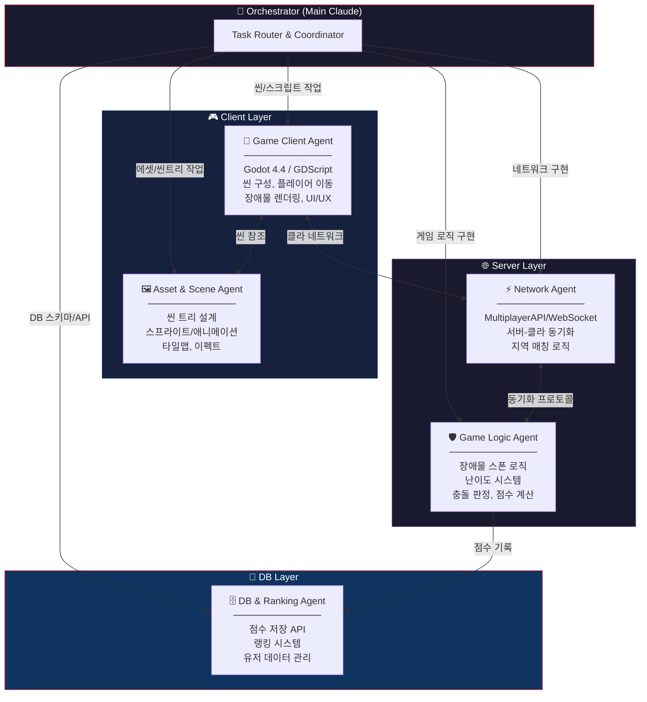

# Team Agent Architecture — 죽림고수(Avoid)

## Agent Team Overview

프로젝트의 3계층(Client / Server / DB)에 맞춰 5개 에이전트 + 1 오케스트레이터로 구성.



## Agent 상세 역할

### 🎯 Orchestrator (Main Claude Session)
| 항목 | 내용 |
|------|------|
| **역할** | 전체 작업 분배, 의존성 관리, 병합 조율 |
| **도구** | Agent tool, TodoWrite, Git |
| **판단 기준** | 작업 복잡도, 의존성 그래프, 충돌 위험도 |

### 🎨 Agent 1: Game Client
| 항목 | 내용 |
|------|------|
| **담당** | 플레이어 캐릭터, 입력 처리, 게임 씬 |
| **subagent_type** | `frontend-architect` |
| **파일 범위** | `*.gd`, `*.tscn` (메인 게임 씬) |
| **의존성** | Asset Agent 씬 구조, Network Agent 동기화 |

### 🖼️ Agent 2: Asset & Scene
| 항목 | 내용 |
|------|------|
| **담당** | 씬 트리 설계, 노드 구조, 리소스 관리 |
| **subagent_type** | `system-architect` |
| **파일 범위** | `*.tscn`, `*.tres`, 리소스 파일 |
| **의존성** | 독립적 (다른 에이전트에 씬 구조 제공) |

### ⚡ Agent 3: Network
| 항목 | 내용 |
|------|------|
| **담당** | 서버-클라이언트 통신, 매칭, 동기화 |
| **subagent_type** | `backend-architect` |
| **파일 범위** | `network/`, `multiplayer/` |
| **의존성** | Game Logic Agent 프로토콜 정의 |

### 🛡️ Agent 4: Game Logic
| 항목 | 내용 |
|------|------|
| **담당** | 장애물 스폰, 난이도, 충돌, 점수 |
| **subagent_type** | `backend-architect` |
| **파일 범위** | `game_logic/`, `obstacles/` |
| **의존성** | Network Agent (서버사이드), DB Agent (점수) |

### 🗄️ Agent 5: DB & Ranking
| 항목 | 내용 |
|------|------|
| **담당** | 점수 저장, 랭킹 조회, 유저 관리 |
| **subagent_type** | `backend-architect` |
| **파일 범위** | `database/`, `api/` |
| **의존성** | Game Logic Agent 점수 데이터 |

## 병렬 실행 전략

### Phase 1: 기반 구축 (병렬)
```
┌─ Agent 1: 플레이어 이동 + 기본 씬 ─────────┐
├─ Agent 2: 씬 트리 + 장애물 씬 설계 ─────────┤  ← 동시 실행
├─ Agent 4: 장애물 스폰 로직 (싱글) ───────────┤
└─ Agent 5: DB 스키마 설계 ────────────────────┘
```

### Phase 2: 통합 (순차 의존)
```
Agent 3: 네트워크 계층 구현
  ← Agent 1 결과 (클라 구조)
  ← Agent 4 결과 (서버 로직)
```

### Phase 3: 연동 (병렬)
```
┌─ Agent 1+3: 클라-서버 연동 테스트 ───────────┐
└─ Agent 4+5: 게임로직-DB 연동 ────────────────┘
```

## Worktree 전략

| Agent | Isolation | 이유 |
|-------|-----------|------|
| Game Client | worktree | 메인 씬 직접 수정 → 충돌 방지 |
| Asset & Scene | worktree | .tscn 파일 동시 수정 위험 |
| Network | worktree | 새 디렉토리 생성, 독립 작업 |
| Game Logic | worktree | 새 디렉토리 생성, 독립 작업 |
| DB & Ranking | worktree | 완전 독립 계층 |
